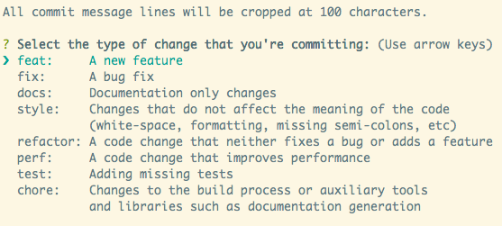

<p align="center">
  
</p>

<p align="center">
  
  
  <a href="http://commitizen.github.io/cz-cli/">  
    
  </a>
  <a href="https://www.linkedin.com/in/nlnadialigia/">  
    
  </a>
  <a href="./LICENSE.md">  
    
  </a>
</p>

<br>

# Índice
[Sobre](#id1)<br>
[Padronização dos commits](#id2)<br>
[Bibliotecas e Ferramentas](#id98)<br>


<br>

<div id="id1"></div>

## 📌 Sobre 

Template com a configuração de um projeto base com Typescript, Eslint, Husky, Commitlint e Commitzen.

<br>

<div id="id2"></div>

## 📌 Padronização commits
### 📝 Commitlint

- verifica se a mensagem de commit está dentro dos padrões pré definidos.

- Instalar    
  ```bash
  yarn add -D @commitlint/config-conventional @commitlint/cli
  ```
    
- Configurar    
  ```bash
  echo "module.exports = { extends: ['@commitlint/config-conventional'] };" > commitlint.config.js
  ```
    
- Testar
  - Retorna um erro porque não está seguindo o padrão do Conventional Commits.
      
    ```bash
    echo "teste" | yarn commitlint
    
    # Retorna erro
    ```
      
  - O teste passa
      
    ```bash
    echo "feat: test" | yarn commitlint
    ```     

### 📝 Husky

- cria ações que serão disparadas antes de um commit ser inicializado.
- configuração do commitlint no husky para verificar se a mensagem do commit está seguindo os padrões recomendados.

- Instalar    
  ```bash
  yarn add -D husky
  ```
    
- Ativar hooks    
  ```bash
  yarn husky install
  ```
    
- Script para ativar hooks automaticamente ⇒ `package.json`
  - esse script serve para que o husky funcione quando o projeto for baixado em outra máquina ou por outra pessoa.
  
  ```json
  "scripts": {
    "husky:init": "husky install"
  }
  ```
    
- Hook para disparar o commitlint    
  ```bash
  yarn husky add .husky/commit-msg 'yarn commitlint --edit $1'
  ```
    
- Testar
  - adicionar os arquivos para serem comitados      
    ```bash
    git add .
    ```
      
  - Falhar o commit para ver se tudo está funcionando        
    ```bash
    git commit -m "qualquer coisa"
    ```
      
  - Fazer o commit corretamente        
    ```bash
    git commit -m "chore: add commitlint e husky"
    ```        

### 📝 Commitizen

- gera uma interface no terminal com os tipos de commits e suas descrições



- Instalar    
  ```bash
  yarn add -D commitizen
  ```
    
- Configurar  
  ```bash
  # Inglês
  yarn commitizen init cz-conventional-changelog --yarn --dev --exact
  ```
  
  ```bash
  # Português
  commitizen init cz-ptbr-changelog --save-dev --save-exact --force
  ```
    
- Adicionar configuração no `package.json`    
  ```json
  "config": {
      "commitizen": {
        "path": "cz-conventional-changelog"
        "path": "./node_modules/cz-ptbr-changelog"
      }
    }
  ```
        
- Script no `package.json` para disparar commitizen    
  ```json
  "scripts": {
    "commit": "git-cz"
  }
  ```
    
- Testar
  - adicionar os arquivos para serem commitados
  - executar o script para iniciar a biblioteca

<br>

<div id="id98"></div>

## 📌 Bibliotecas e Ferramentas

#### 📎 Dependências de desenvolvimento

* [Commitlint](https://commitlint.js.org/#/)
* [Commitizen](https://github.com/commitizen/cz-cli)
* [Eslint](https://eslint.org/)
* [Git](https://git-scm.com/)
* [Husky](https://typicode.github.io/husky/#/)
* [Ts node](https://www.npmjs.com/package/ts-node)
* [Typescript](https://www.typescriptlang.org/)
